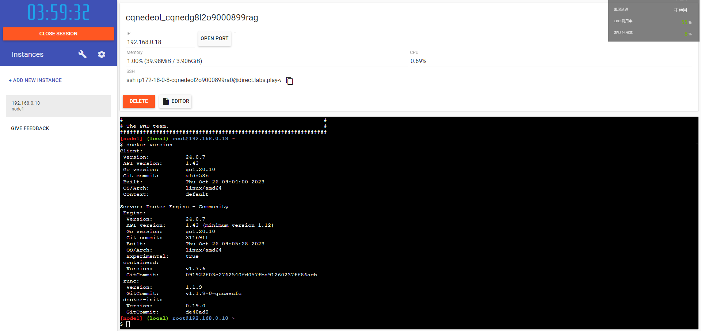
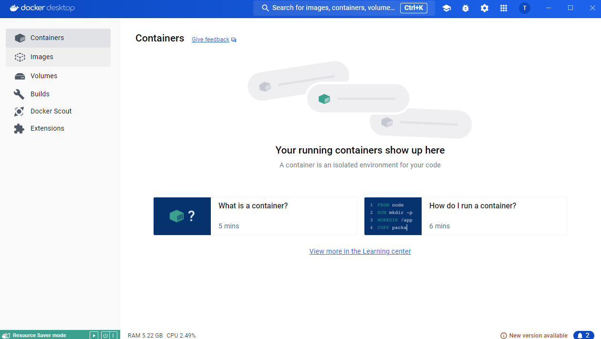
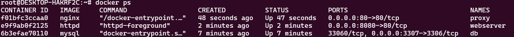
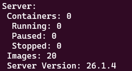
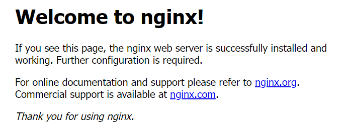
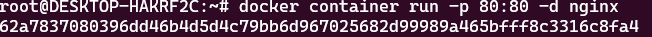

# Docker Tutorial


**記錄我在Udemy上所學，  
由講師Bret Fisher所教授Docker Mastery: with Kubernetes +Swarm**

**[什麼是Docker?](#什麼是docker)**  
**[Try it!](#try-it)**  
**[安裝教學(Windows環境下)](#安裝教學windows環境下)**  
**[建立/使用Containers](#建立使用containers)**  

- **[Assignmet 1](#assignment-manage-multiple-containers)**  

**[Container Images，如何查看以及建立](#container-images如何查看以及建立)**  
**[Volumes](#volumes)**  
**[Docker Compose (Build/Use Compose File)](#docker-compose-builduse-compose-file)**  
**[Swarm](#swarm)**  

## 什麼是Docker?  
Docker 是一種開源軟體平台，它的構想理念是「Build and Ship any Application Anywhere」，意即讓開發者在虛擬環境中，開發、部署和管理任的何應用程式。Docker 的輕量化特性，提供應用程式獨立的測試環境。讓使用者只需專注於應用程式的開發，為他們省下建置環境的時間與精力。  

##  Try it!! 
如果覺得直接安裝有點不知所措Docker是在幹嘛的話，歡迎先試玩看看  
[Play with Docker](https://labs.play-with-docker.com/)  
這是一個線上平台，允許用戶在網頁瀏覽器中運行 Docker 容器。  
它提供了一個沙盒環境，用戶可以在這裡實驗 Docker 命令、部署容器，並學習 Docker，而不需要在本地安裝任何軟件。你會獲得一個臨時的免費環境，能夠實時練習和學習 Docker。這個平台對於開發者、DevOps 工程師和學生來說特別有用，讓他們可以探索 Docker 的各種功能。  
  

## 安裝教學(Windows環境下)
在Windows環境下要使用Docker首先要先下載兩個東西  
1. [Docker Desktop(DD)](https://www.docker.com/products/docker-desktop/)  
   選擇Download for Windows  
   DD is free for learning !  
   DD裡面包含很多工具，主要工具像是: Engine / CLI / Compose / BUildKits / Kubernetes & more  
   
2. [WSL2](https://learn.microsoft.com/zh-tw/windows/wsl/install)  
   詳見連結如何安裝(Ubuntu版本請自行下載下來)  
   (建議可以將wsl設定在其他槽，避免c槽容量不足的問題發生。 [參考方法](https://hackmd.io/@Kuihao/wsl))      

一切都安裝完成後打開你的CMD(建議將Powershell預設改Linux)，方便之後操作使用。  
輸入docker version測試是否成功安裝:  
```
docker version
```  
docker version回傳的內容表示安裝在你系統上的 Docker 客戶端和伺服器（Docker 引擎）的詳細版本資訊     
出現以下資訊代表成功 (目的是確保客戶端可以跟Engine對話)  
  

```
docker info
```
輸入docker info，除了顯示版本資訊以外，還可以知道目前正在運作的項目數  


## 建立/使用Containers  
**Container(容器)是什麼?**  
所謂的 Container 其實是一種虛擬化技術，透過將應用程式及其依賴(如程式碼、函式庫、組態)打包成單一物件，接著利用容器平台(docker)就能在不同環境也能運行相同的應用程式。不僅提供一致的軟體環境，也能輕鬆在任何地方執行及擴展應用程式，而這些特性就是 DevOps 所需的，將開發者與維運人員之間的溝通變得更為輕鬆。透過 Container 技術，開發者就能將複雜的安裝步驟及程式碼封裝成物件，提供給維運人員部屬，讓軟體交付的過程精簡成較為簡單的問題。  

**Image vs. Container**  
- An Image is the application we want to run  
- A Container is an instance of that image running as a process  
- You can have many containers running off the same image  
- Docker's default image "registry" is called Docker Hub  

**如何建立?**  
Ex. Create a Nginx(web server) container  
註: Nginx is the Image we want to use  

```
docker container run <image-name>
```  
這個指令是在幹嘛呢?  
它是表示從Image開啟(啟動)一個新的container  

實際舉一個例子:  
```
docker container run -p 80:80 nginx
```

- **從Docker Hub自動下載名為"nginx"的Image**    
- **利用該Image開啟/啟動一個新的Container**    
- **Opened port 80 on the host IP**  
- **Routes that traffic to the container IP, port 80**  
執行後到打開瀏覽器在網址端輸入 : localhost 若有跑出以下畫面代表成功  
  
在cmd輸入ctrl+c便可以中斷連接  

```
docker container run -p 80:80 -d nginx
```  
和前面不同的是，這裡多加了-d(--detach的簡寫)  
detach可以告訴Docker在後台運行它  
然後我們可以得到唯一的Container ID(注意:每次運行新的Container時，都會得到一個新的獨一ID)    


**常用的container指令**  
- **dokcer container ls**  
  list running containers.  
- **docker top (container name)**  
  list running processes in specific container.  
- **docker container stop (container ID)**  
  stops the container process but doesn't remove it.  

**run vs. start**  
docker container run & docker container start的差別    
在於run是啟用"新的"container而start是啟用"已經存在的"但目前被stopped的container  

- **docker container ls -a**  
  list all containers(including stopped)  

- **docker container logs (container name)**  
  show logs for a specific container.  

- **docker container rm (ID)**  
  remove(delete) one of more containers.  (註: -f可以強制刪除正在運行的containers)  

### What happens in 'docker container run'  
1. Looks for that image locally in image cache, doesn't find anything  
2. Then lookd in remote image repository (defaults to Docker Hub)  
3. Downloads the latest version (nginx:latest by default)  
4. Creates new container based on that image and prepares to start  
5. Gives it a virtual IP on a private network inside docker engine  
6. Opens up port 80 on host and forwards to port 80 in container  
7. Starts container by using the CMD in the image Dockerfile  

### Assignment: Manage Multiple Containers  

## Container Images，如何查看以及建立  

## Volumes  

## Docker Compose (Build/Use Compose File)  

## Swarm  
